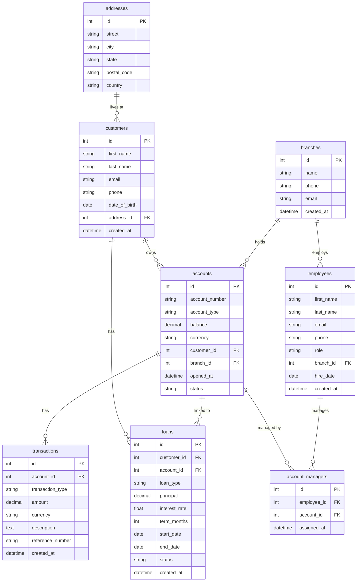

# ER Diagram – AgenticSQL Database

```mermaid
erDiagram
    addresses {
        int id PK
        string street
        string city
        string state
        string postal_code
        string country
    }

    customers {
        int id PK
        string first_name
        string last_name
        string email
        string phone
        date date_of_birth
        int address_id FK
        datetime created_at
    }

    branches {
        int id PK
        string name
        string phone
        string email
        datetime created_at
    }

    employees {
        int id PK
        string first_name
        string last_name
        string email
        string phone
        string role
        int branch_id FK
        date hire_date
        datetime created_at
    }

    accounts {
        int id PK
        string account_number
        string account_type
        decimal balance
        string currency
        int customer_id FK
        int branch_id FK
        datetime opened_at
        string status
    }

    account_managers {
        int id PK
        int employee_id FK
        int account_id FK
        datetime assigned_at
    }

    transactions {
        int id PK
        int account_id FK
        string transaction_type
        decimal amount
        string currency
        text description
        string reference_number
        datetime created_at
    }

    loans {
        int id PK
        int customer_id FK
        int account_id FK
        string loan_type
        decimal principal
        float interest_rate
        int term_months
        date start_date
        date end_date
        string status
        datetime created_at
    }

    addresses ||--o{ customers : "lives at"
    customers ||--o{ accounts : "owns"
    customers ||--o{ loans : "has"
    branches ||--o{ employees : "employs"
    branches ||--o{ accounts : "holds"
    accounts ||--o{ transactions : "has"
    accounts ||--o{ loans : "linked to"
    accounts ||--o{ account_managers : "managed by"
    employees ||--o{ account_managers : "manages"
```
